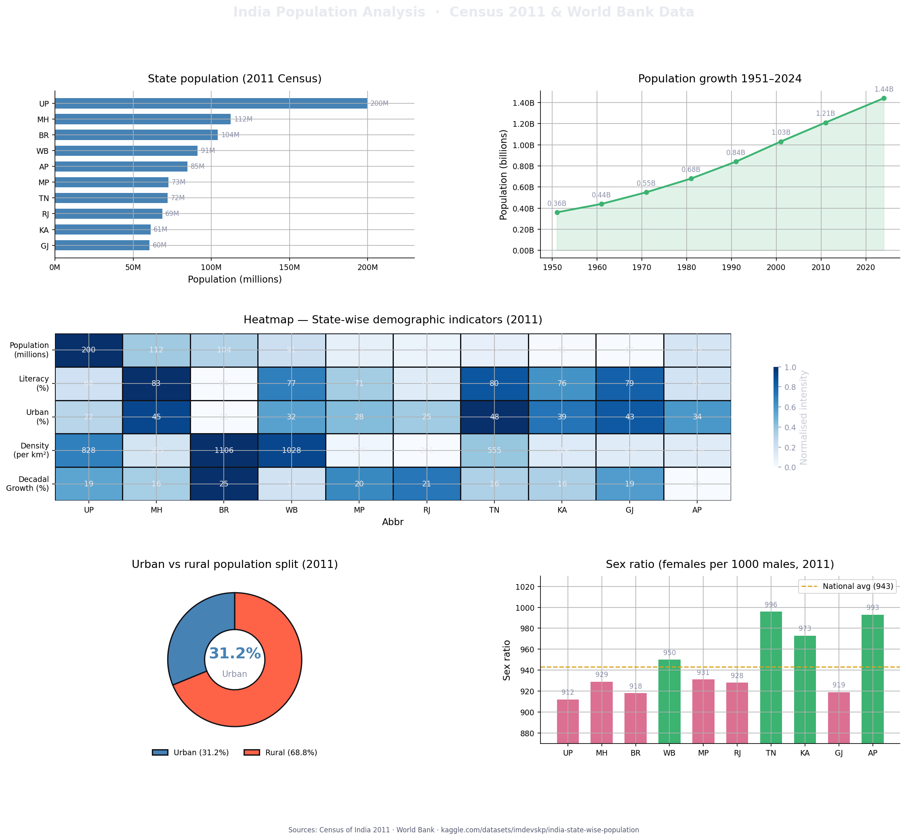
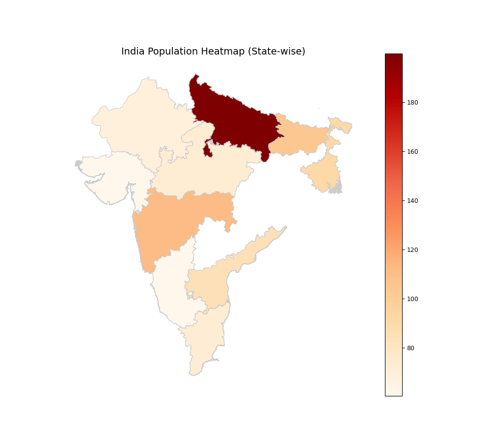

# India Population Analysis — Matplotlib Project

A data visualization project analyzing India's population demographics using **Matplotlib** and **Seaborn**. Built with real Census 2011 and World Bank data.

\


---

## Charts Included

| Chart | Description |
|---|---|
| Horizontal Bar Chart | Top 10 states by population (2011 Census) |
| Line Chart | India's total population growth from 1951 to 2024 |
| Heatmap | 5 demographic indicators across 10 states (min-max normalized) |
| Doughnut Chart | Urban vs Rural population split |
| Bar Chart | Sex ratio by state vs national average |

---

## Datasets

| Source | Link |
|---|---|
| Census of India (official) | https://censusindia.gov.in/census.website/data/population-finder |
| Kaggle — State-wise Population | https://www.kaggle.com/datasets/imdevskp/india-state-wise-population |
| World Bank — India Population | https://data.worldbank.org/indicator/SP.POP.TOTL?locations=IN |

---

## Requirements

```bash
pip install matplotlib seaborn numpy pandas
```

---

## Run

```bash
python india_population_project.py
```

The script saves the dashboard as `india_population_analysis.png` in the same folder and opens it in an interactive matplotlib window.

---

## Project Structure

```
india-population-analysis/
│
├── india_population_project.py    # Main script
├── india_population_analysis.png  # Generated dashboard
└── README.md                      # This file
```

---

## Key Insights

- **Uttar Pradesh** is the most populous state with ~200 million people, nearly double Maharashtra (112M)
- India's population grew from **0.36 billion (1951)** to **1.44 billion (2024)**
- Only **31.2%** of India's population lived in urban areas as of 2011
- **Tamil Nadu** and **Andhra Pradesh** have the best sex ratios (996 and 993), well above the national average of 943
- **Bihar** has the highest population density (1106/km²) and the highest decadal growth rate (25.1%)
- **Maharashtra** leads in literacy (82.9%) and urbanization (45.2%) among the top 10 states

---

## Heatmap Details

The heatmap uses **min-max normalization** per column so that all 5 indicators — despite having different units and scales — can be compared by color intensity on the same scale (0 to 1). Raw values are printed inside each cell for readability.

---

## Sources

- Census of India 2011
- World Bank Open Data
- Kaggle — [India State-wise Population by @imdevskp](https://www.kaggle.com/datasets/imdevskp/india-state-wise-population)